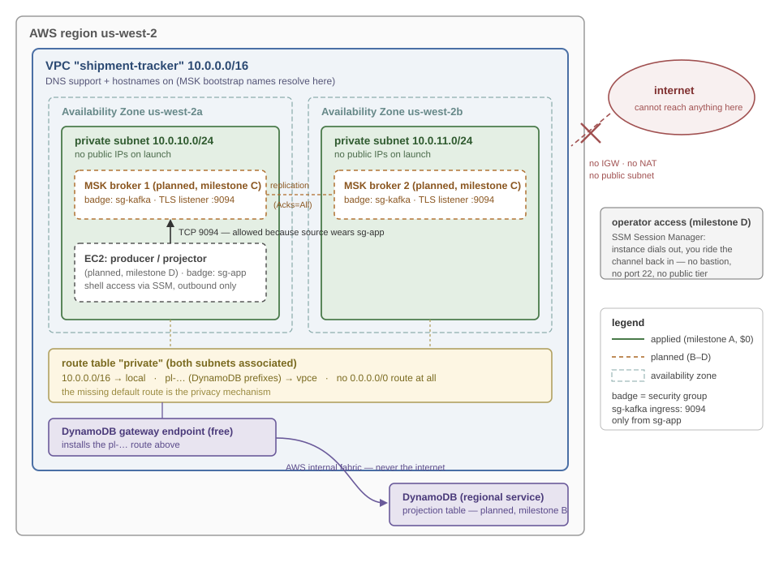

# shipment-tracker

A small event-driven shipment-tracking system in F# and Kafka. Shipment
lifecycle events flow through Kafka, partitioned by shipment ID, and an
F# consumer folds them into a current-state projection. Most of the
design effort went into the failure modes: ordering, delivery
semantics, poison messages, and replay.

**Status:** the local system works end to end (producer → Kafka →
projector → projection, with a dead-letter topic). Consumer-side
idempotency and the AWS deployment described below are in progress —
see the [roadmap](#roadmap).

## Architecture

```
┌──────────────────┐   shipment-events    ┌───────────────────┐
│ Producer (CLI)   │   6 partitions,      │ Projector         │    per-shipment
│ demo / simulate  ├────keyed by─────────►│ (consumer group,  ├──► current-state
│                  │    shipmentId        │  manual commits)  │    projection
└──────────────────┘                      └─────────┬─────────┘
                                                    │ undecodable /
                                                    │ rejected events
                                                    ▼
                                          shipment-events-dlq
```

| Project | Role |
|---|---|
| `ShipmentTracker.Domain` | Event types, projection state, the transition function, and the wire contract. Pure functions over immutable data; no IO or Kafka dependencies. |
| `ShipmentTracker.Producer` | CLI that publishes single lifecycles (`demo`) or seeded, interleaved multi-shipment scenarios (`simulate`). |
| `ShipmentTracker.Projector` | The consumer: decode → apply → project → commit, plus dead-lettering. All of the operational Kafka behavior is concentrated here. |

The core of the domain is a single pure function:

```fsharp
Shipment.apply : ShipmentState option -> Envelope -> Result<ShipmentState, TransitionError>
```

Current state is a fold of `apply` over a shipment's events; the
projector is that fold running continuously, with Kafka feeding it
events and a store holding the accumulator between steps. Since state is
derived, the projection is disposable: delete it, reset the consumer
group, and it rebuilds by replaying the topic.

## Design decisions and tradeoffs

### Partition key = shipmentId

Events for one shipment always land in one partition, so each shipment's
history is strictly ordered. That is also the only ordering guarantee
the system has: events of different shipments interleave arbitrarily,
and the projector has to be correct regardless. The costs are that
partition count is fixed up front (changing it remaps keys) and that a
single hot shipment can't be split across partitions; both are
acceptable here.

### At-least-once delivery

The projector uses manual commits in a strict order: process, persist,
then commit the offset. A crash between persist and commit means the
event is redelivered, so duplicates are a normal part of operation
rather than an edge case. The alternative order (commit before process)
would lose events on a crash in that window, and a lost event is harder
to detect than a duplicate is to absorb.

Producer-side idempotence (`enable.idempotence`) is also on. It
deduplicates broker-level retries, which is a separate problem from
duplicate consumer processing; that one is handled by comparing an
envelope's `eventId` against the projection's `lastEventId` and
skipping matches as benign redeliveries. With the in-memory store this
covers redelivery within a process lifetime; the durable store will
extend it across crashes, since that is what remembers `lastEventId`.

### An authored wire contract (Thoth.Json)

Events cross the wire as JSON with an explicit envelope: `eventId`,
`shipmentId`, `correlationId`, `occurredAt`, `schemaVersion`, an
`eventType` discriminator, and the payload. The encoders and decoders
are written by hand with Thoth.Json rather than generated by
reflection, so the wire format is visible in source, and decoding
returns a `Result` with a precise error message instead of throwing —
which is what feeds the dead-letter path. Schema policy: additive
changes only; unknown event types and unsupported schema versions are
rejected with errors that name the offending value. With multiple teams
producing and consuming I would use a schema registry instead; at this
scale a hand-written contract is easier to read and to test.

### Dead-letter topic

A poison message shouldn't halt its partition, but it also shouldn't
disappear. Undecodable messages and rejected transitions are published
to `shipment-events-dlq` with the error, the source
topic/partition/offset, and the original bytes — enough to diagnose the
failure and replay the message. The DLQ write is awaited before the
source offset is committed, so a crash between the two redelivers the
message instead of losing the record. A known tradeoff: dead-lettering
an event gives up strict ordering for that shipment from that point on.

### Deliberate simplifications

- Every event belongs to a single shipment; a container is an attribute
  of a shipment's events, not its own event stream. Modeling containers
  as aggregates would raise cross-stream ordering questions that this
  project is scoped to avoid.
- The Confluent.Kafka client is used directly, without a messaging
  framework, to keep commits, rebalances, and delivery semantics visible
  in the code.
- Topic auto-creation is disabled; topics are created explicitly with
  chosen partition counts, so a typo in a topic name fails instead of
  creating a new topic.
- The projection store is in-memory for now, and restart-and-replay is
  the recovery model. DynamoDB is the planned store — a conditional
  write can persist the projection and enforce the idempotency check in
  one operation (see the AWS section).

## Running it

Prerequisites: .NET 8, Docker.

```powershell
docker compose up -d

# create the topics (auto-create is disabled)
docker compose exec kafka /opt/kafka/bin/kafka-topics.sh --bootstrap-server localhost:9092 --create --topic shipment-events --partitions 6 --replication-factor 1
docker compose exec kafka /opt/kafka/bin/kafka-topics.sh --bootstrap-server localhost:9092 --create --topic shipment-events-dlq --partitions 1 --replication-factor 1

# publish one full lifecycle, then a reproducible interleaved scenario
dotnet run --project src/ShipmentTracker.Producer -- demo SHP-100
dotnet run --project src/ShipmentTracker.Producer -- simulate 4 42   # same seed => same scenario

# run the projector (Ctrl+C to stop; --idle-exit N for scripted runs)
dotnet run --project src/ShipmentTracker.Projector
```

The projector prints the projection as it builds:

```
[ok]   SIM-003: Created
[ok]   SIM-001: InTransit (container CONT-1684)
[ok]   SIM-001: Delivered (container CONT-1684, cleared by CN-SHA, signed Linus)
```

To see the dead-letter path, publish something malformed and read the
DLQ:

```powershell
'not an envelope' | docker compose exec -T kafka /opt/kafka/bin/kafka-console-producer.sh --bootstrap-server localhost:9092 --topic shipment-events
docker compose exec kafka /opt/kafka/bin/kafka-console-consumer.sh --bootstrap-server localhost:9092 --topic shipment-events-dlq --from-beginning --timeout-ms 5000
```

Tests (`dotnet test`) cover every cell of the transition table, the full
lifecycle fold, and round-trips plus rejection paths of the wire
contract.

## Operational behavior

- Replay / rebuild: reset the consumer group (or use a new group id) and
  the projection rebuilds from the log. The topic is the system of
  record.
- Scaling consumers: the projector scales horizontally up to the
  partition count (6). Kafka rebalances partitions across group members,
  and per-shipment ordering survives because a shipment never spans
  partitions.
- Consumer crash: the group rebalances the dead member's partitions to
  the survivors, and events since the last committed offset are
  redelivered (the at-least-once behavior described above).
- Backpressure: Kafka consumers pull, so a slow projector polls less and
  lag grows. The metric to watch is consumer lag.

## AWS deployment (in progress; network layer applied)



Solid outlines exist (created by the Terraform in `infra/terraform`, all
free-tier); dashed outlines are the planned milestones. There is no NAT
gateway: the only egress from the private subnets is the free DynamoDB
gateway endpoint, and operator access will use SSM Session Manager
rather than a bastion, so no public subnet is needed at all.

MSK because the broker is the system of record; DynamoDB because a
single conditional write can persist the projection and enforce the
idempotency check atomically; CloudWatch for logs and consumer-lag
metrics. The brokers live in private subnets with no route to an
internet gateway, so they are unreachable from the internet regardless
of any other configuration. MSK is expensive to leave running, so the
Terraform is built for an apply → exercise → destroy workflow rather
than an always-on deployment.

## Influences

The design leans on *Designing Data-Intensive Applications* (2nd ed.,
Kleppmann & Riccomini): the sharding chapter for key-based partitioning
and skew; the encoding-and-evolution chapter for the schema-versioning
policy behind the wire contract; and the stream-processing material for
log-based brokers, consumer offsets, at-least-once delivery, and
maintaining state as a fold over an event log. Where this project
diverges from the book's recommendations — a hand-written JSON contract
instead of a schema registry, a single aggregate instead of many — the
tradeoff sections above say why.

## Roadmap

- [x] Consumer-side idempotency: events whose `eventId` matches the
      projection's `lastEventId` are skipped as redelivered duplicates
      (full effect arrives with the durable store below)
- [ ] Structured logging (Serilog) with correlation IDs end to end
- [ ] Integration tests against real Kafka (Testcontainers)
- [ ] DynamoDB projection store (local first, then AWS)
- [ ] Terraform for the MSK/DynamoDB/CloudWatch deployment above
      (network layer applied; MSK and compute to come)
